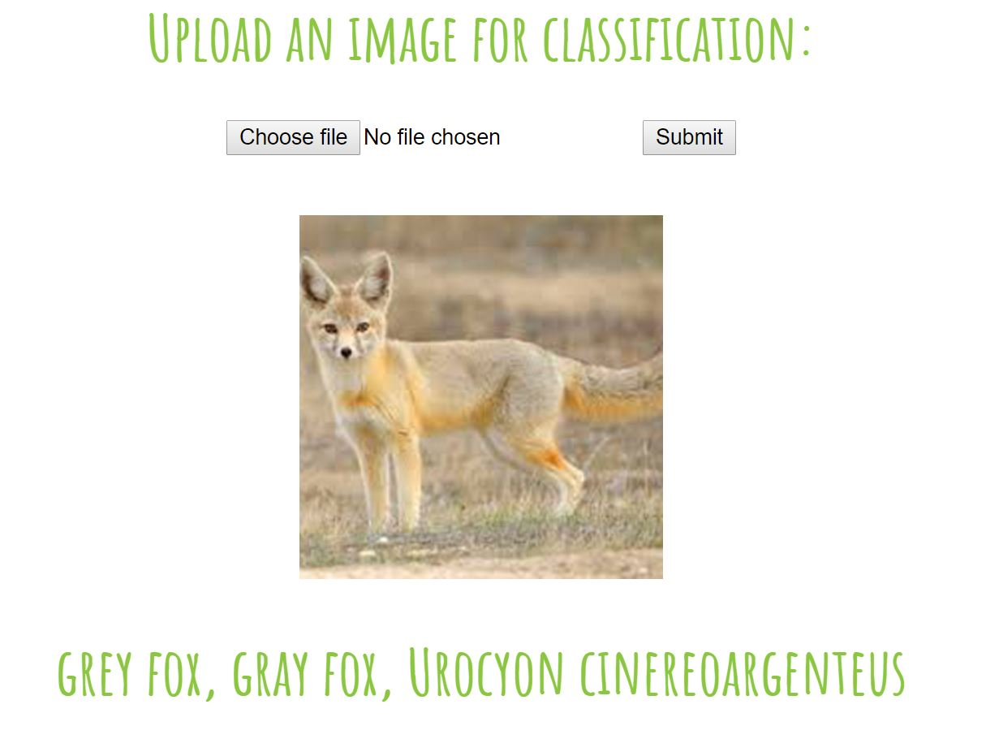
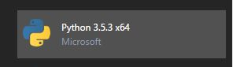

# Installing CNTK w/ Demo Model on Azure Web Apps

[Check out step-by-step YouTube](https://youtu.be/nMZ8lTo-96k)

[Demo](http://cntkwebappik.azurewebsites.net)



**For this guide to work without modifications you must install the "Python 3.5.3 x64" extension**



## A - Prerequisites

1. Create a folder that will contain the data for your web-app and download all of the contents of this repo into it:
	```
	mkdir <YourWebAppFolderName>
	```

2. (Optional) The Python 3.5 (64bit) wheel for [Pillow]](https://azurewebappcntk.blob.core.windows.net/wheels/Pillow-4.0.0-cp35-cp35m-win_amd64.whl) is already located in the "Wheels" folder. If you require additional wheels, you can go to http://www.lfd.uci.edu/~gohlke/pythonlibs/ to download the wheel (t othe wheels folder) and then add it to "requirements.txt" file at the root of the directory. **Note: [Numpy](https://azurewebappcntk.blob.core.windows.net/wheels/numpy-1.12.1+mkl-cp35-cp35m-win_amd64.whl), [Scipy](https://azurewebappcntk.blob.core.windows.net/wheels/scipy-0.19.0-cp35-cp35m-win_amd64.whl), and [CNTK](https://azurewebappcntk.blob.core.windows.net/wheels/cntk-2.0.beta11.0-cp35-cp35m-win_amd64.whl) wheels are automatically installed by the script; to change this you can edit the deploy.cmd file**

3. At the end of this step you should have:
	```
	<YourWebAppFolderName>
	- logs
	-- init.txt
	- Model
	-- ResNet_18.model
	-- synset-1k.txt
	- Wheels
	-- Pillow-4.0.0-cp35-cp35m-win_amd64.whl
	- WebApp
	-- model.py
	-- templates
	--- index.html
	- .deployment
	- deploy.cmd
	- README.md
	- requirements.txt
	- runserver.py
	- web.config
	```

## B - Create & Configure Web-App

1. Create a web-app and setup the git-credentials by running the following Azure CLI **(note: this currently uses the old version v1 of Azure CLI and will soon be updated to use azure-cli v2.0)** commands (or by using Azure Portal):
	```
	cd <YourWebAppFolderName>
	azure login
	azure account list
	azure account set <Subscription ID to become default>
	azure config mode asm
	azure site create --git <yourWebAppSiteName>
	```

	If you don't already have a git user-name configured for Azure then you will need to go to the "Deployment Credentials" blade to setup your credentials on Azure Portal.

2. Navigate to your web-app on Azure Portal and click on the "Scale up (App Service plan)" blade and select "S1" (or more powerful if needed, however S1 is the minimum for this guide)

3. Scroll down to the "Extensions" blade, click on "Add", locate "Python 3.5.3 x64" and add it

4. (Optional) Under the "Application settings" blade set "Always On" to "On" to reduce the response time (since your model will be kept loaded)

## C - Deploy Demo

1. (Optional) Assuming you have used Python 3.5 (x64) and CNTK v2.0 Beta 11 you don't have to change anything in the deployment script. The install script automatically adds the binaries for [CNTK v2.0 Beta11](https://azurewebappcntk.blob.core.windows.net/cntk2beta11win/cntk.zip). However if you are using Python 3.6 or CNTK v2.0 Beta 12+ then alter the below in the "deploy.cmd" script:
	```
	SET PYTHON_EXE=%SYSTEMDRIVE%\home\python353x64\python.exe
	SET NUMPY_WHEEL=https://azurewebappcntk.blob.core.windows.net/wheels/numpy-1.12.1+mkl-cp35-cp35m-win_amd64.whl
	SET SCIPY_WHEEL=https://azurewebappcntk.blob.core.windows.net/wheels/scipy-0.19.0-cp35-cp35m-win_amd64.whl
	SET CNTK_WHEEL=https://azurewebappcntk.blob.core.windows.net/wheels/cntk-2.0.beta11.0-cp35-cp35m-win_amd64.whl
	SET CNTK_BIN=https://azurewebappcntk.blob.core.windows.net/cntk2beta11win/cntk.zip
	echo "Installed python extension installed here:"
	``` 
	You just need to extract the cntk/cntk folder (i.e. the folder that contains 'CNTK.exe' and DLLs; you can remove the python sub-folder which contains the wheels) and then reference it with the %CTNK_BIN% environmental variable (assuming you have also extracted the relevant wheel from cntk/cntk/python).

2. Deploy this demo by running:
	```
	cd <YourWebAppFolderName>
	git add -A
	git commit -m "init"
	git push azure master
	```

3. You should now be able to navigate to your web-app address and upload a photo that will be classified according to the CNN: ResNet-18

4. To modify this for your own needs, alter the "model.py" script as desired in the folder "WebApp", along with the HTMl template, "index.html" in "templates" and then push your changes to the repo:
	```
	git add -A
	git commit -m "modified some script"
	git push azure master
	```