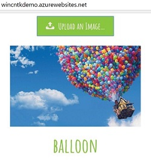

# Deploy CNTK to Azure Web Apps

Azure offers several ways of deploying a deep-learning model (e.g. CNTK): Windows Web App, Linux (Docker) Web App, and Azure Container Services (Docker). Both of the Docker methods are perhaps more convenient, however they are not publicly available at the time of writing. Hence, in this post we will deploy a ResNet-18 model to Azure Web Apps and then submit some test pictures to it using a sample HTML interface and also via python.

## Result:

[Website Demo](http://wincntkdemo.azurewebsites.net/)

**HTML** 



**Python**


The above screenshot is taken from [this](https://github.com/ilkarman/Azure-WebApp-w-CNTK/blob/master/readme_support/REST.ipynb) notebook. If you wish to run some speed-tests then [this](https://github.com/ilkarman/Azure-WebApp-w-CNTK/blob/master/readme_support/REST_Speed_Test.ipynb) notebook shows how to submit asyncrochonous requests to the created API to get an idea of how long it takes to classify images in bulk.

## Replicate Demo

1. Download the contents of [this](https://github.com/ilkarman/Azure-WebApp-w-CNTK) repo and open a Command Prompt in the folder

2. Run the following commands to check you have git and azure-cli installed:
	```
	az --version  # time-of-writing: 2.0.1
	pip install azure-cli  # otherwise install azure-cli
	git --version # time of writing: 2.9.2.windows.1
	```
3. Set your username and password for local git deployment (you only need to do this once) e.g.:
	```
	set uname=<username_for_local_git_deployment>
	set pass=<password_for_local_git_deployment>
	# Create a user-name and password for git deployment of all your apps
	az appservice web deployment user set --user-name %uname% --password %pass%
	```

4. Create your web-app by running the below commands:
	```
	# Name for your web-app
	set appn=<app_name>
	# Name for resource-group containing web-app
	set rgname=<name_for_resource_group_that_contains_app>
	# Login to azure
	az login
	# Create a resource-group
	az group create --location westeurope --name %rgname%
	# Create a paid 'S2' plan to support your app
	# The standard paid plans are: S1, S2, S3
	az appservice plan create --name %appn% --resource-group %rgname% --sku S2
	# Create the web-app
	az appservice web create --name %appn% --resource-group %rgname% --plan %appn%
	# Configure for local git deployment (SAVE URL)
	az appservice web source-control config-local-git --name %appn% --resource-group %rgname% --query url --output tsv
	# Initialise your git repo
	git init
	# Add the azure endpoint
	git remote add azure <PASTE_URL_FROM_ABOVE>
	# e.g. git remote add azure https://ilia2ukdemo@wincntkdemo.scm.azurewebsites.net/wincntkdemo.git
	```

5. We will now install Python. Navigate to your web-app on Azure Portal, scroll down to the "Extensions" blade and select it:

	

	Then, click on "Add", locate "Python 3.5.3 x64" and add it (*you must use this extension*)

	

	Make sure you get a notification that this installed successfully:

	

6. (Optional) Under the "Application settings" blade set "Always On" to "On" to reduce the response time (since your model will be kept loaded)

7. Deploy this demo by running:
	```
	git add -A
	git commit -m "init"
	git push azure master
	```

	If everything has gone successfully you should see the following line in the script output:

	```
	remote: Successfully installed cntk-2.0rc1
	remote: ..
	remote: 2.0rc1
	```

You should now be able to navigate to your web-app address and upload a photo that will be classified according to the CNN: ResNet-18

## Advanced modifications (run your own)

1. You can include references to other modules (e.g. pandas or opencv) in your model.py file, however you must add the module to the "requirements.txt" file so that python installs the module. If the module needs to be built you can you can go to http://www.lfd.uci.edu/~gohlke/pythonlibs/ to download the pre-built wheel file (to the wheels folder). Don't forget to add the wheel path to the "requirements.txt" file at the root of the directory. **Note: [Numpy](https://azurewebappcntk.blob.core.windows.net/wheels/numpy-1.12.1+mkl-cp35-cp35m-win_amd64.whl), [Scipy](https://azurewebappcntk.blob.core.windows.net/wheels/scipy-0.19.0-cp35-cp35m-win_amd64.whl), and [CNTK](https://azurewebappcntk.blob.core.windows.net/cntkrc/cntk-2.0rc1-cp35-cp35m-win_amd64.whl) wheels are automatically installed inside the "deploy.cmd" script; to change this you can edit the deploy.cmd file to point to whichever numpy wheel you require**	

2. **Editing deploy.cmd** -  the install script automatically adds the binaries for [CNTK v2.0 rc1](https://azurewebappcntk.blob.core.windows.net/cntkrc/cntk.zip). However if you want to use **Python 3.6 or CNTK v2.0 rc1+** then alter the below in the "deploy.cmd" script:
	```
	:: VARIABLES
	echo "ATTENTION"
	echo "USER MUST CHECK/SET THESE VARIABLES:"
	SET PYTHON_EXE=%SYSTEMDRIVE%\home\python353x64\python.exe
	SET NUMPY_WHEEL=https://azurewebappcntk.blob.core.windows.net/wheels/numpy-1.12.1+mkl-cp35-cp35m-win_amd64.whl
	SET SCIPY_WHEEL=https://azurewebappcntk.blob.core.windows.net/wheels/scipy-0.19.0-cp35-cp35m-win_amd64.whl
	SET CNTK_WHEEL=https://azurewebappcntk.blob.core.windows.net/cntkrc/cntk-2.0rc1-cp35-cp35m-win_amd64.whl
	SET CNTK_BIN=https://azurewebappcntk.blob.core.windows.net/cntkrc/cntk.zip
	``` 
	To create the 'cntk.zip' file you just need to extract the cntk/cntk folder (i.e. the folder that contains 'CNTK.exe' and DLLs; you can remove the python sub-folder which contains the wheels, if it exists) and then reference it with the %CTNK_BIN% environmental variable above.

3. You can also install a different python extension if you wish, however make sure to reference it properly (and also to get the Numpy, Scipy and CNTK Wheels for it). For example, the "Python 3.5.3 x64" extension is installed in the directory "D:\home\python353x64\", and thus the script references:
	```SET PYTHON_EXE=%SYSTEMDRIVE%\home\python353x64\python.exe```

4. Finally, alter the "model.py" script as desired in the folder "WebApp", along with the HTMl template, "index.html" in "templates" and then push your changes to the repo:
	```
	git add -A
	git commit -m "modified some script"
	git push azure master
	```